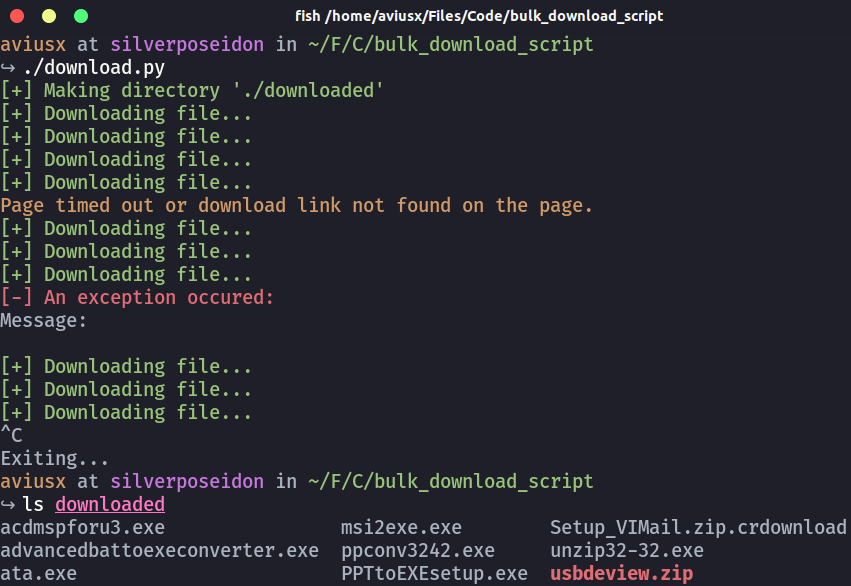

# bulk-binary-downloader
###### Downloads binaries in bulk from en.freedownloadmanager.org. Tested on Ubuntu 20.04 with Python 3.8.5

---
#### Required packages:
```
colorama
selenium
os
time
```

#### Required binaries:
```
chromedriver
```
Chromedriver can be downloaded from [here](https://chromedriver.chromium.org/downloads).

### Usage

#### Required:

- Edit the path to your chromedriver on `Line 12` of `download.py`.
- Run
```bash
python3 download.py
```
- The script will download the files into `./downloaded/` where `.` is your `present working directory`.

#### Optional / Troubleshooting:

The script will try to ignore failed downloads and move on to the next download.

In case the script fails anyway, you don't need to restart the whole process. Just edit the starting page number to start from where the script failed by changing the `starting_page_number` on `Line 14`.

The final page number (by default) is 43. This can be changed if there are more pages in the future or if you want to use another URL on the same website. To do this, just change `final_page_number` on `Line 15`

#### Screenshot / Demo Video:

The demo video can be found [here](https://youtu.be/0SaMrtYrng0).


